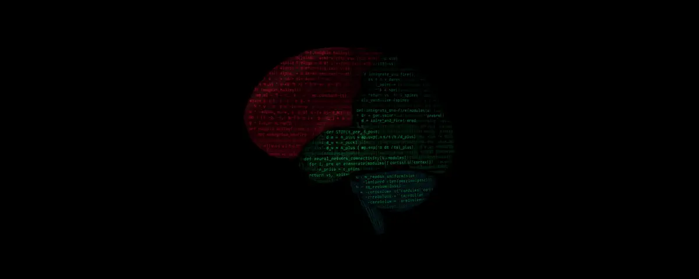

<p align="center">
  
</p>

<h1 align="center">Yaroslav Vasylenko</h1>

<p align="center"><strong>AI Systems Architect · Controlled Inference · Agent Verification</strong></p>

<p align="center">
  <a href="https://neuron7x-site-140887.gitlab.io/"><strong>Explore NEURON7X services →</strong></a>
  ·
  <a href="#selected-work">Selected work</a>
  ·
  <a href="mailto:neuron7x@gmail.com">Start a conversation</a>
</p>

I turn ambiguous AI and research requirements into bounded, testable systems.
My work is designed to be inspected, reproduced, and challenged—not merely
demonstrated.

My work focuses on the difficult layer between an AI-generated result and a
result that can be trusted: typed contracts, deterministic execution,
fail-closed validation, adversarial tests, provenance, CI gates, and replayable
evidence.

Based in Ukraine · Available for remote contract work

## What I can deliver

- **AI agent systems:** tool-using agents, structured outputs, MCP integrations,
  multi-agent workflows, evaluation harnesses, and human approval boundaries.
- **Python engineering:** typed APIs, FastAPI and Pydantic services, scientific
  pipelines, test architecture, refactoring, packaging, and automation.
- **Verification infrastructure:** property-based and mutation testing,
  deterministic replay, schema validation, provenance ledgers, security gates,
  and reproducible CI.
- **Research-to-software translation:** turning mathematical or experimental
  ideas into bounded implementations with explicit assumptions, baselines, and
  falsifiers.
- **Repository recovery and consolidation:** auditing divergent histories,
  preserving provenance, migrating namespaces, and producing one documented,
  testable source of truth.

## Selected work

### [GeoSync / Kuramoto synchronization model](https://github.com/neuron7x/Kuramoto-synchronization-model)

A verification-first quantitative research platform for falsifiable
market-structure hypotheses. It combines dynamical-systems research with data
contracts, machine-checkable invariants, null baselines, artifact schemas, and
replayable evidence. The repository explicitly separates implemented
mechanisms from claims supported by data.

`Python` · `pytest` · `Hypothesis` · `Pydantic` · `CI/CD` · `scientific computing`

### [neosynaptex](https://github.com/neuron7x/neosynaptex)

Cross-domain coherence diagnostics built around explicit measurement and claim
boundaries. The project explores scaling and synchronization across physical,
biological, and cognitive substrates without treating analogy as proof.

`Python` · `dynamical systems` · `verification` · `reproducible research`

### [substrate-universe](https://github.com/neuron7x/substrate-universe)

A pure-NumPy multi-physics orchestration experiment combining
reaction–diffusion dynamics, Kuramoto/Ricci mechanisms, spiking dynamics, and a
hash-bound evidence ledger.

`NumPy` · `simulation` · `determinism` · `evidence artifacts`

### [PFC Coherent Induction](https://github.com/neuron7x/pfc-coherent-induction)

A brain-inspired, fail-closed cognitive-control experiment with explicit state
transitions and SHA-256 evidence records.

`Python` · `cognitive architectures` · `control systems` · `auditability`

## How I reason about systems

```text
Frame → Bound → Formalize → Falsify → Build → Attack → Reproduce → Decide
```

I decompose systems from purpose to mechanism, invariant, test, and evidence.
I separate analogy from mechanism, implementation from validation, and local
results from independent proof. Negative results remain part of the record.

```text
No claim without a boundary.
No boundary without a falsifier.
No verdict without provenance.
No release without replay.
```

AI agents generate, implement, and critique. They do not approve their own
work. Acceptance is determined by explicit contracts, adversarial tests,
reproducible evidence, and human judgment.

### Evidence boundaries

- Repository-tested does not mean independently certified.
- A synthetic benchmark does not imply a production outcome.
- A brain-inspired mechanism remains an engineering hypothesis until validated.
- Coverage supports assurance; it does not prove correctness.

## Core stack

`Python` · `FastAPI` · `Pydantic` · `pytest` · `Hypothesis` · `mypy` · `ruff` ·
`GitHub Actions` · `GitLab CI` · `Docker` · `Linux` · `Bash` · `TypeScript` ·
`Rust` · `MCP` · `LLM APIs` · `agent evaluation` · `scientific Python`

Applied methods include Kuramoto/Sakaguchi synchronization, Lyapunov analysis,
Ollivier/Forman–Ricci curvature, persistent homology, reaction–diffusion, and
time-series validation. These are implementation domains, not unsupported
claims of scientific discovery.

## Training

- Anthropic Academy: Building with the Claude API
- Anthropic Academy: Claude Code in Action
- Anthropic Academy: Introduction to MCP
- Anthropic Academy: MCP — Advanced Topics
- Anthropic Academy: Introduction to Subagents
- GoIT: Prompt Engineering & AI Agents — 77 hours, certificate ID 44505

Public credential verification links are available in my project materials or
on request.

## Work with me

**Services and engagement options:**
[NEURON7X storefront](https://neuron7x-site-140887.gitlab.io/)

I am a strong fit when a project needs more than a prototype—especially when
the output must be testable, maintainable, reproducible, and safe to hand to
another engineer.

Typical engagements:

- build or repair an AI-agent workflow;
- turn a research prototype into a tested Python package;
- design an evaluation or falsification harness;
- audit and consolidate a complex repository;
- add deterministic CI, provenance, and release evidence;
- diagnose reliability, data-quality, or architecture failures.

Email: [neuron7x@gmail.com](mailto:neuron7x@gmail.com)<br>
Telegram: [@neuron7x](https://t.me/neuron7x)
